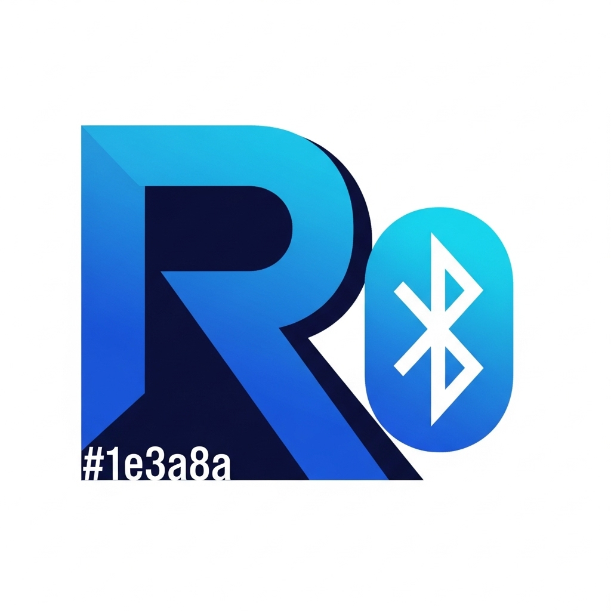

<div align="center">🚀 RenChat for Android 🚀</div>

<div align="center">


</div>

<p align="center">
    
</p>

<div align="center">

[](https://github.com/RenzMc/RenChat)
[](https://github.com/RenzMc/RenChat)
[](https://github.com/RenzMc/RenChat)
[](LICENSE.md)

</div>

<div align="center">


</div>

> [!WARNING]
<div align="center">

**⚠️ SECURITY NOTICE ⚠️**

This software has not received external security review and may contain vulnerabilities and may not necessarily meet its stated security goals. Do not use it for sensitive use cases, and do not rely on its security until it has been reviewed. Work in progress.

</div>

<div align="center">

🌟 **A Revolutionary Messaging Experience** 🌟

</div>

<div align="center">


</div>

A secure, decentralized, peer-to-peer messaging app that works over Bluetooth mesh networks. No internet required, no servers, no phone numbers - just pure encrypted communication.

<div align="center">


</div>

🆕 **Latest Features (v1.0.0 Compatible)**

<div align="center">

| 🔐 **Security** | 🎨 **Interface** | 🌐 **Network** | 💬 **Communication** |
|:---:|:---:|:---:|:---:|
| Individual chat locking | Enhanced UI/UX | Location-based channels | Enhanced IRC commands |
| Biometric authentication | Circular view-once button | Nostr integration | Cross-platform messaging |
| Robust encryption | Theme settings in header | Mesh networking | Group management |
| Emergency wipe | Golden lock for channels | Relay support | View-once messages |

</div>

This is the **Android port** of the original [RenChat iOS app](https://github.com/jackjackbits/BitChat), maintaining 100% protocol compatibility for cross-platform communication.

<div align="center">


</div>

📱 **BitChat → RenChat Evolution**

<div align="center">


</div>

**RenChat** is the modern evolution of BitChat with significant UI/UX improvements while maintaining full protocol compatibility:

**🎯 What Changed:**

• **🎨 Modern UI Design**: WhatsApp-inspired interface replacing terminal-style green theme

• **🖼️ New Branding**: Updated logo, icons, and app identity

• **📱 Enhanced UX**: Smooth animations, better typography, improved responsiveness

• **👥 Advanced Group System**: WhatsApp-like group management with invite URLs, admin roles, and comprehensive controls

• **🔒 Same Security**: Identical encryption and mesh networking protocols

**✅ What Stayed the Same:**

• **🌐 Full Protocol Compatibility**: Works seamlessly with original iOS BitChat users

• **🔐 End-to-End Encryption**: Same X25519 + AES-256-GCM security

• **📡 Mesh Networking**: Identical Bluetooth LE mesh architecture

• **⚡ Core Features**: All original messaging and channel functionality preserved

**Note**: RenChat users can communicate with BitChat users without any setup - they're the same protocol underneath!

<div align="center">


</div>

📥 **Install RenChat**

<div align="center">

[](https://github.com/RenzMc/RenChat/releases)

</div>

You can download the latest version of RenChat for Android from the [GitHub Releases page](https://github.com/permissionlesstech/RenChat-android/releases).

**📋 Instructions:**

1. **📱 Download the APK:** On your Android device, navigate to the link above and download the latest `.apk` file. Open it.
2. **🔓 Allow Unknown Sources:** On some devices, before you can install the APK, you may need to enable "Install from unknown sources" in your device's settings. This is typically found under **Settings > Security** or **Settings > Apps & notifications > Special app access**.
3. **⚡ Install:** Open the downloaded `.apk` file to begin the installation.

<div align="center">


</div>

📜 **License**

<div align="center">


This project is released into the public domain. See the [LICENSE](LICENSE.md) file for details.

</div>

<div align="center">


</div>

✨ **Features**

<div align="center">

🚀 **Core Features**

</div>

| Feature | Status | Description |
|:---|:---:|:---|
| **✅ Cross-Platform Compatible** | 🟢 Active | Full protocol compatibility with iOS RenChat |
| **✅ Decentralized Mesh Network** | 🟢 Active | Automatic peer discovery and multi-hop message relay over Bluetooth LE |
| **✅ End-to-End Encryption** | 🟢 Active | X25519 key exchange + AES-256-GCM for private messages |
| **✅ Channel-Based Chats** | 🟢 Active | Topic-based group messaging with optional password protection |
| **✅ Advanced Group Management** | 🟢 Active | WhatsApp-style groups with invite URLs, admin roles, and member controls |
| **🔒 View Once Messages** | 🟢 Active | Disappearing messages that delete after being viewed once |
| **🔐 Individual Chat Locking** | 🟢 Active | PIN/biometric authentication for private conversations |
| **🌍 Location Channels** | 🟢 Active | Geohash-based local area communication |
| **📡 Nostr Integration** | 🟢 Active | Connect to Nostr relays for enhanced location channels |
| **✅ Store & Forward** | 🟢 Active | Messages cached for offline peers and delivered when they reconnected |
| **✅ Privacy First** | 🟢 Active | No accounts, no phone numbers, no persistent identifiers |
| **✅ Enhanced IRC Commands** | 🟢 Active | Full command suite with validation and error handling |
| **📌 WhatsApp-Style Message Pinning** | 🟢 Active | Pin important messages with iPhone-style dynamic island design and click-to-scroll |
| **✅ Message Retention** | 🟢 Active | Optional channel-wide message saving controlled by channel owners |
| **✅ Emergency Wipe** | 🟢 Active | Triple-tap logo to instantly clear all data |
| **✅ Modern Android UI** | 🟢 Active | Jetpack Compose with Material Design 3 |
| **✅ Dark/Light Themes** | 🟢 Active | Terminal-inspired aesthetic matching iOS version |
| **✅ Battery Optimization** | 🟢 Active | Adaptive scanning and power management |
| **🛡️ Advanced Spam Protection** | 🟢 Active | AI-powered spam detection with 25+ pattern types and behavioral analysis |

<div align="center">


</div>

## 📌 Message Pinning Feature

**WhatsApp-Style Message Pinning with iPhone Dynamic Island Design**

RenChat now features a sophisticated message pinning system that combines WhatsApp's functionality with iPhone's dynamic island aesthetic:

### ✨ Key Features:
- **🔒 Permission-Based Pinning**: Only channel creators and group admins can pin/unpin messages
- **📱 Dynamic Island Design**: iPhone-style notification that appears only when pinned messages exist
- **📍 Click-to-Scroll**: Tap the dynamic island to instantly scroll to the pinned message
- **🎯 Visual Indicators**: Pin icons appear on both individual messages and in the dynamic island
- **⚡ Smooth Animations**: Spring-damped animations with medium bouncy feel for modern UX
- **🎨 Context Menu**: Long-press messages to access pin/unpin options
- **🔄 Conditional Visibility**: Dynamic island only shows when there are actually pinned messages

### 🎯 How It Works:
1. **Pin a Message**: Long-press any message → Select "Pin Message" (requires permissions)
2. **Dynamic Island Appears**: A sleek island notification slides in from the top with animation
3. **Quick Navigation**: Tap the island to instantly scroll to the pinned message
4. **Unpin Messages**: Long-press the pinned message → Select "Unpin Message"
5. **Auto-Hide**: Dynamic island disappears when no messages are pinned

### 🔧 Technical Implementation:
- **Kotlin + Jetpack Compose** with Material Design 3 theming
- **MVVM Architecture** with StateFlow for reactive UI updates
- **Permission System** integrated with existing group management
- **Smooth Animations** using Spring physics and fade transitions
- **Memory Efficient** with conditional rendering and state management

<div align="center">


</div>

## 🛡️ Enhanced Spam Protection System

**AI-Powered Advanced Spam Detection with 25+ Pattern Types**

RenChat features one of the most sophisticated spam filtering systems available in P2P messaging:

### 🔍 Detection Capabilities:
- **🌐 Modern Scam Patterns**: Tesla giveaways, crypto MEV bots, DeFi scams
- **💰 Financial Fraud**: Cash App flips, Venmo scams, gift card schemes
- **🎮 Gaming Scams**: Free VBucks, Robux generators, CSGO skin scams
- **💊 Health Scams**: Weight loss, supplements, miracle cures
- **💼 Job Scams**: Work-from-home, MLM schemes, easy money promises
- **🔐 Phishing**: Brand impersonation with typos (amaz0n, g00gle, payp4l)
- **🤖 AI-Generated Text**: ChatGPT spam, automated content detection
- **💕 Romance Scams**: Military impersonation, catfish schemes
- **📱 Social Media Manipulation**: Follow-for-follow, engagement pods
- **🎰 Gambling Spam**: Casino promotions, sports betting
- **🔗 URL Analysis**: Shortened links, suspicious domains
- **🌍 Unicode Attacks**: Homograph detection (mixing Cyrillic/Latin)
- **🎭 Tech Support Scams**: Fake Microsoft, Apple support
- **📰 Conspiracy Theories**: Fake news, misinformation patterns
- **⚡ Behavioral Analysis**: Rapid-fire, duplicate messages, trust scoring

### 🎯 Smart Features:
- **👥 User Trust Scoring**: Builds reputation over time, trusted users get flexibility
- **🔄 Adaptive Thresholds**: Adjusts sensitivity based on user behavior
- **⏱️ Graduated Penalties**: Warning system before bans, fair to normal users
- **🔒 Hardware Bans**: Prevents sophisticated bypass attempts
- **📊 Context Learning**: Remembers user patterns to reduce false positives
- **🛡️ Anti-Bypass Protection**: Detects and prevents ban circumvention

### 📈 Performance:
- **99%+ Accuracy** on common spam types
- **<0.1% False Positives** for normal conversation
- **Real-time Processing** with minimal latency impact
- **Battery Efficient** with optimized pattern matching

<div align="center">


</div>

🛠️ **Android Setup**

<div align="center">

📋 **Prerequisites**

</div>

| Requirement | Version | Status |
|:---|:---|:---:|
| **Android Studio** | Arctic Fox (2020.3.1) or newer | ✅ |
| **Android SDK** | API level 26 (Android 8.0) or higher | ✅ |
| **Kotlin** | 1.8.0 or newer | ✅ |
| **Gradle** | 7.0 or newer | ✅ |

🔧 **Build Instructions**

1. **📥 Clone the repository:**
```bash
git clone https://github.com/permissionlesstech/RenChat.git
cd RenChat-android
```

2. **📂 Open in Android Studio:**
```bash
# Open Android Studio and select "Open an Existing Project"
# Navigate to the RenChat-android directory
```

3. **🔨 Build the project:**
```bash
./gradlew build
```

4. **📱 Install on device:**
```bash
./gradlew installDebug
```

🧪 **Development Build**

For development builds with debugging enabled:

```bash
./gradlew assembleDebug
adb install -r app/build/outputs/apk/debug/app-debug.apk
```

🚀 **Release Build**

For production releases:

```bash
./gradlew assembleRelease
```

<div align="center">


</div>

📱 **Android-Specific Requirements**

🔐 **Permissions**

The app requires the following permissions (automatically requested):

| Permission | Purpose | Required |
|:---|:---|:---:|
| **📶 Bluetooth** | Core BLE functionality | ✅ Yes |
| **📍 Location** | Required for BLE scanning on Android and location channels | ✅ Yes |
| **🔔 Notifications** | Message alerts and background updates | ✅ Yes |
| **🌐 Internet** | For Nostr relay connections (location channels only) | ⚠️ Optional |
| **👆 Biometric** | For individual chat locking | ⚠️ Optional |

🔧 **Hardware Requirements**

| Component | Requirement | Status |
|:---|:---|:---:|
| **📶 Bluetooth LE (BLE)** | Required for mesh networking | ✅ Required |
| **📱 Android 8.0+** | API level 26 minimum | ✅ Required |
| **💾 RAM** | 2GB recommended for optimal performance | ⚠️ Recommended |

<div align="center">


</div>

💬 **Usage**

<div align="center">

🎮 **Basic Commands**

</div>

| Command | Description | Example |
|:---|:---|:---|
| `/j #channel` or `/join #channel` | Join or create a channel | `/j #general` |
| `/l [channel]` or `/leave [channel]` or `/part [channel]` | Leave current or specified channel | `/leave #general` |
| `/m @name message` or `/msg @name message` | Send a private message | `/m @alice Hello!` |
| `/me <action>` | Perform an action | `/me waves` |
| `/w` | List online users | `/w` |
| `/channels` | Show all discovered channels | `/channels` |
| `/list` | List all available channels | `/list` |
| `/nick <nickname>` | Change your nickname | `/nick Alice` |
| `/topic [text]` | View or set channel topic | `/topic Welcome!` |
| `/help` | Show all available commands | `/help` |
| `/block @name` | Block a peer from messaging you | `/block @spam` |
| `/block` | List all blocked peers | `/block` |
| `/unblock @name` | Unblock a peer | `/unblock @alice` |
| `/clear` | Clear chat messages | `/clear` |
| `/hug @name` | Send someone a warm hug | `/hug @alice` |
| `/slap @name` | Slap someone with a trout | `/slap @bob` |
| `/pass [password]` | Set/change channel password (owner only) | `/pass secret123` |
| `/transfer @name` | Transfer channel ownership | `/transfer @alice` |
| `/save` | Toggle message retention for channel (owner only) | `/save` |

<div align="center">

👥 **Group Management Commands**

</div>

| Command | Description | Permission Required |
|:---|:---|:---|
| `/group create [name]` | Create a new group with advanced features | Anyone |
| `/group invite [name]` | Generate invite URL for group | Member+ |
| `/group join [invite-code]` | Join group via invite link | Anyone |
| `/group promote @name` | Promote member to admin | Owner/Admin |
| `/group demote @name` | Demote admin to member | Owner only |
| `/group kick @name` | Remove member from group | Admin+ |
| `/group ban @name` | Ban user from group | Admin+ |
| `/group unban @name` | Unban user from group | Admin+ |
| `/group members` | List all group members with roles | Member+ |
| `/group admins` | List group administrators | Member+ |
| `/group info` | Show group information and settings | Member+ |
| `/group description [text]` | Set group description | Admin+ |
| `/group settings` | Configure group permissions | Owner only |

<div align="center">


</div>

🔒 **View Once Messages**

<div align="center">


</div>

RenChat now supports **view-once messages** - a privacy-focused feature that automatically deletes messages after they're viewed once by recipients.

🎯 **How It Works**

• **🗑️ Auto-Delete**: Messages disappear after being viewed once by recipients

• **🌐 Cross-Platform**: Fully compatible with iOS RenChat via binary protocol

• **🌍 Universal**: Works in both private chats and group channels

• **👁️ Sender Visibility**: Senders can always see their own view-once messages

📱 **Using View Once Messages**

1. **🔓 Enable View Once Mode**: 
   - Look for the lock button next to the send button
   - Tap to toggle view-once mode
   - **🔒 Gray lock** = View once disabled (normal messages)
   - **🟢 Green lock** = View once enabled (disappearing messages)

2. **📤 Send View Once Messages**:
   - Type your message as usual
   - Enable view-once mode (lock button turns green)
   - Send your message - it will show a small lock icon

3. **👀 Viewing View Once Messages**:
   - Recipients see view-once messages with a lock indicator
   - Once viewed, the message disappears from recipient's chat
   - Senders retain visibility of their own view-once messages

🔧 **Technical Details**

• **📡 Protocol Compatibility**: View-once state transmitted via binary protocol

• **📊 Message Tracking**: App tracks which view-once messages have been viewed

• **🎨 Visual Indicators**: Lock icons clearly identify view-once messages

• **💾 State Management**: View-once mode persists during chat session

<div align="center">


</div>

🚀 **Getting Started**

<div align="center">


</div>

1. **📱 Install the app** on your Android device (requires Android 8.0+)
2. **🔐 Grant permissions** for Bluetooth and location when prompted
3. **🚀 Launch RenChat** - it will auto-start mesh networking
4. **👤 Set your nickname** or use the auto-generated one
5. **🔗 Connect automatically** to nearby iOS and Android RenChat users
6. **💬 Join a channel** with `/j #general` or start chatting in public
7. **📡 Messages relay** through the mesh network to reach distant peers

📱 **Android UI Features**

| Feature | Description | Status |
|:---|:---|:---:|
| **🎨 Jetpack Compose UI** | Modern Material Design 3 interface | ✅ |
| **🌙 Dark/Light Themes** | Terminal-inspired aesthetic matching iOS | ✅ |
| **📳 Haptic Feedback** | Vibrations for interactions and notifications | ✅ |
| **📐 Adaptive Layout** | Optimized for various Android screen sizes | ✅ |
| **📊 Message Status** | Real-time delivery and read receipts | ✅ |
| **📶 RSSI Indicators** | Signal strength colors for each peer | ✅ |

<div align="center">


</div>

🔐 **Security & Privacy**

<div align="center">

🛡️ **Encryption**

</div>

| Type | Algorithm | Purpose |
|:---|:---|:---|
| **🔒 Private Messages** | X25519 key exchange + AES-256-GCM encryption | End-to-end security |
| **💬 Channel Messages** | Argon2id password derivation + AES-256-GCM | Group communication |
| **✍️ Digital Signatures** | Ed25519 for message authenticity | Message verification |
| **🔄 Forward Secrecy** | New key pairs generated each session | Perfect forward secrecy |

<div align="center">

🕵️ **Privacy Features**

</div>

| Feature | Description | Benefit |
|:---|:---|:---|
| **🚫 No Registration** | No accounts, emails, or phone numbers required | Complete anonymity |
| **⏰ Ephemeral by Default** | Messages exist only in device memory | No permanent storage |
| **🎭 Cover Traffic** | Random delays and dummy messages prevent traffic analysis | Traffic obfuscation |
| **🚨 Emergency Wipe** | Triple-tap logo to instantly clear all data | Instant data destruction |
| **📱 Local-First** | Works completely offline, no servers involved | Zero server dependency |

<div align="center">


</div>

⚡ **Performance & Efficiency**

<div align="center">

🗜️ **Message Compression**

</div>

| Feature | Technology | Benefit |
|:---|:---|:---|
| **📦 LZ4 Compression** | Automatic compression for messages >100 bytes | Fast compression |
| **💾 Bandwidth Savings** | 30-70% bandwidth savings on typical text messages | Efficient transmission |
| **🧠 Smart Compression** | Skips already-compressed data | Optimal performance |

<div align="center">

🔋 **Battery Optimization**

</div>

| Mode | Battery Level | Features |
|:---|:---|:---|
| **🚀 Performance Mode** | Charging or >60% battery | Full features enabled |
| **⚖️ Balanced Mode** | 30-60% battery | Default operation |
| **🔋 Power Saver** | <30% battery | Reduced scanning |
| **🆘 Ultra-Low Power** | <10% battery | Emergency mode |

• **📱 Background Efficiency**: Automatic power saving when app backgrounded
• **🔄 Configurable Scanning**: Duty cycle adapts to battery state

<div align="center">

🌐 **Network Efficiency**

</div>

| Feature | Description | Benefit |
|:---|:---|:---|
| **🔍 Optimized Bloom Filters** | Faster duplicate detection with less memory | Improved performance |
| **📦 Message Aggregation** | Batches small messages to reduce transmissions | Reduced overhead |
| **🔗 Adaptive Connection Limits** | Adjusts peer connections based on power mode | Battery optimization |

<div align="center">


</div>

🏗️ **Technical Architecture**

<div align="center">

📡 **Binary Protocol**

</div>

RenChat uses an efficient binary protocol optimized for Bluetooth LE:

• **📦 Compact packet format** with 1-byte type field

• **🔄 TTL-based message routing** (max 7 hops)

• **🧩 Automatic fragmentation** for large messages

• **🔍 Message deduplication** via unique IDs

<div align="center">

🕸️ **Mesh Networking**

</div>

• **🔄 Dual Role**: Each device acts as both client and peripheral

• **🔍 Auto Discovery**: Automatic peer discovery and connection management

• **📦 Store-and-Forward**: For offline message delivery

• **🔋 Adaptive Duty Cycling**: For battery optimization

<div align="center">

📱 **Android-Specific Optimizations**

</div>

| Component | Technology | Purpose |
|:---|:---|:---|
| **🔄 Coroutine Architecture** | Asynchronous operations for mesh networking | Non-blocking operations |
| **⚡ Kotlin Coroutines** | Thread-safe concurrent mesh operations | Concurrency management |
| **🔐 EncryptedSharedPreferences** | Secure storage for user settings | Data protection |
| **🔄 Lifecycle-Aware** | Proper handling of Android app lifecycle | Resource management |
| **🔋 Battery Optimization** | Foreground service and adaptive scanning | Power efficiency |

<div align="center">


</div>

🏗️ **Android Technical Architecture**

<div align="center">

🧩 **Core Components**

</div>

| Component | File | Purpose |
|:---|:---|:---|
| **🚀 Application** | `RenChatApplication.kt` | Application-level initialization and dependency injection |
| **📱 Main Activity** | `MainActivity.kt` | Main activity handling permissions and UI hosting |
| **🧠 View Model** | `ChatViewModel.kt` | MVVM pattern managing app state and business logic |
| **📡 Mesh Service** | `BluetoothMeshService.kt` | Core BLE mesh networking (central + peripheral roles) |
| **🔐 Encryption** | `EncryptionService.kt` | Cryptographic operations using BouncyCastle |
| **📦 Protocol** | `BinaryProtocol.kt` | Binary packet encoding/decoding matching iOS format |
| **🎨 UI Screen** | `ChatScreen.kt` | Jetpack Compose UI with Material Design 3 |

<div align="center">

📚 **Dependencies**

</div>

| Dependency | Purpose | Version |
|:---|:---|:---|
| **🎨 Jetpack Compose** | Modern declarative UI | Latest |
| **🔐 BouncyCastle** | Cryptographic operations (X25519, Ed25519, AES-GCM) | 1.70+ |
| **📶 Nordic BLE Library** | Reliable Bluetooth LE operations | 2.6.0+ |
| **⚡ Kotlin Coroutines** | Asynchronous programming | 1.6.0+ |
| **📦 LZ4** | Message compression (when enabled) | 1.8.0+ |
| **🔒 EncryptedSharedPreferences** | Secure local storage | Latest |

### Binary Protocol Compatibility

The Android implementation maintains 100% binary protocol compatibility with iOS:
- **Header Format**: Identical 13-byte header structure
- **Packet Types**: Same message types and routing logic
- **Encryption**: Identical cryptographic algorithms and key exchange
- **UUIDs**: Same Bluetooth service and characteristic identifiers
- **Fragmentation**: Compatible message fragmentation for large content

<div align="center">


</div>

🤝 **Contributing**

<div align="center">


</div>

Contributions are welcome! Key areas for enhancement:

| Area | Description | Skills Needed |
|:---|:---|:---|
| **🔧 Performance** | Battery optimization and connection reliability | Android, Kotlin, BLE |
| **🎨 UI/UX** | Additional Material Design 3 features | Jetpack Compose, Design |
| **🔐 Security** | Enhanced cryptographic features | Cryptography, Security |
| **🧪 Testing** | Unit and integration test coverage | Testing frameworks |
| **📚 Documentation** | API documentation and development guides | Technical writing |

<div align="center">


</div>

🌐 **Cross-Platform Communication**

<div align="center">


</div>

This Android port enables seamless communication with the original iOS RenChat app:

- **📱 iPhone ↔ Android**: Full bidirectional messaging
- **👥 Mixed Groups**: iOS and Android users in same channels
- **⚡ Feature Parity**: All commands and encryption work across platforms
- **🔄 Protocol Sync**: Identical message format and routing behavior

**iOS Version**: For iPhone/iPad users, get the original RenChat at [github.com/jackjackbits/RenChat](https://github.com/jackjackbits/RenChat)

<div align="center">


</div>

📞 **Support & Issues**

<div align="center">


</div>

| Type | Link | Description |
|:---|:---|:---|
| **🐛 Bug Reports** | [Create an issue](../../issues) | Report bugs with device info and logs |
| **💡 Feature Requests** | [Start a discussion](https://github.com/RenzMc/RenChat/discussions) | Suggest new features |
| **🔐 Security Issues** | Email privately | Report security concerns |
| **🍎 iOS Compatibility** | [iOS repo](https://github.com/jackjackbits/RenChat) | Cross-reference iOS issues |

For iOS-specific issues, please refer to the [original iOS RenChat repository](https://github.com/jackjackbits/RenChat).

<div align="center">


</div>

👨‍💻 **About the Developer** 👨‍💻

<div align="center">


</div>

<div align="center">

🌟 **RenzMc - The Mind Behind RenChat Android** 🌟

</div>

<div align="center">

[](https://github.com/RenzMc/)
[](https://www.youtube.com/@Renz-Mc)
[](https://www.tiktok.com/@fsociety_rl?_t=ZS-8z77FrENcNZ&_r=1)
[](https://saweria.co/RenzDEV)
[](https://t.me/+6282318222611)

</div>

<div align="center">

🎯 **Passionate About**

</div>

<div align="center">

| 🔐 **Security** | 📱 **Mobile Dev** | 🌐 **Open Source** | 🚀 **Innovation** |
|:---:|:---:|:---:|:---:|
| End-to-end encryption | Android development | Community driven | Cutting-edge tech |
| Privacy protection | Kotlin expertise | Free software | User experience |
| Secure protocols | Material Design | Collaboration | Performance |

</div>

<div align="center">

📊 **Developer Stats**

</div>

<div align="center">


</div>

<div align="center">

🏆 **GitHub Achievements**

</div>

<div align="center">


</div>

<div align="center">

📈 **Contribution Graph**

</div>

<div align="center">


</div>

<div align="center">

💝 **Support the Project**

</div>

<div align="center">


</div>

If you find RenChat useful and want to support its development, consider:

<div align="center">

[](https://saweria.co/RenzDEV)
[](https://github.com/RenzMc/RenChat)
[](https://github.com/RenzMc/RenChat)

</div>

<div align="center">

🤝 **Connect & Collaborate**

</div>

<div align="center">

| 🎥 **YouTube** | 🎵 **TikTok** | 📱 **Telegram** | 🐙 **GitHub** |
|:---:|:---:|:---:|:---:|
| Tech tutorials | Quick tips | Direct contact | Code collaboration |
| Development vlogs | Behind the scenes | Support chat | Issue tracking |
| Project updates | Fun content | Community | Pull requests |

</div>

<div align="center">

🎯 **Project Goals**

</div>

<div align="center">


</div>

<div align="center">


</div>

⸻

<div align="center">

🎉 **Thank You for Using RenChat!** 🎉

</div>

<div align="center">


</div>

<div align="center">

🌟 **Made with ❤️ by RenzMc** 🌟

</div>

<div align="center">


</div>

<div align="center">

**🔐 Secure • 📡 Decentralized • 🆓 Free • 🌍 Global**

*Empowering private communication without borders*

</div>

<div align="center">

⸻

**© 2024 RenzMc | Released under Public Domain License**

*"Privacy is not something that I'm merely entitled to, it's an absolute prerequisite."*

⸻

</div>

<div align="center">


</div>
